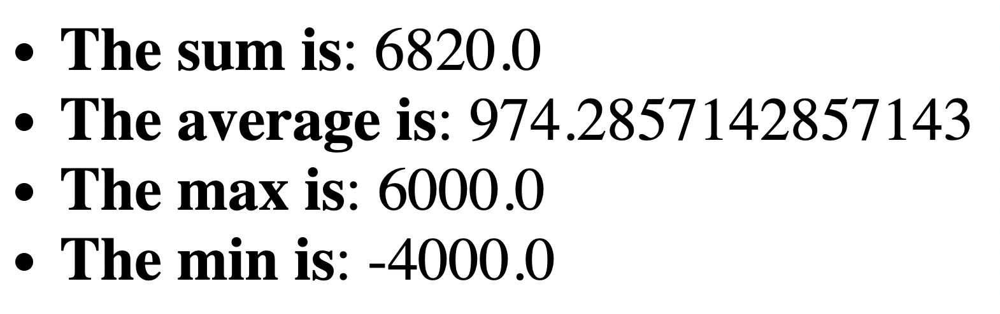

# 🏦 입출금 내역 분석기

이 프로그램은 [Real-World-Software-Development](https://github.com/Iteratr-Learning/Real-World-Software-Development.git) 소스코드 중 챕터 3을 작성한 소스입니다.

## 실행방법

```bash
java -cp (현재디렉토리)/target/classes com.llighter.demo.App sample.csv
```

또는

사용하는 IDE에서 메이븐 프로젝트로 열어서 `sample.csv` 파라미터로 실행

## 실행환경

* [Visual Studio Code](https://code.visualstudio.com/)
* [Extension Pack for Java](https://marketplace.visualstudio.com/items?itemName=vscjava.vscode-java-pack)
* Java version: openjdk 11.0.11

## 구현내용

* `sample.csv` 파일을 파싱하여 입출금 내역에 대한 리포트를 `HTML` 형식으로 출력


## TODO

☑️ `JSON`, `XML` 등 다양한 데이터 형식으로 내보내는 기능 추가

☑️ 입출금 내역 분석기에 기본 `GUI`를 추가


